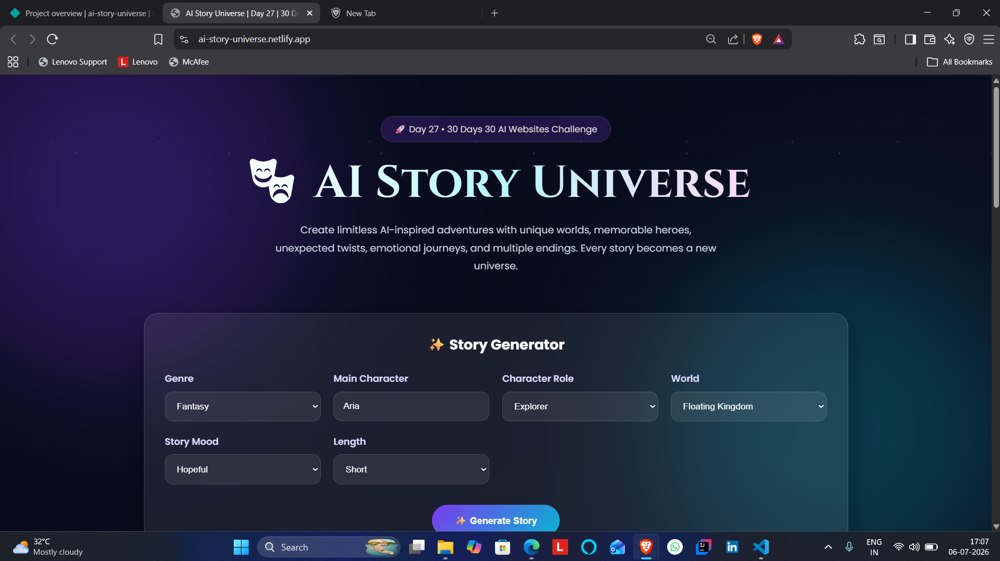
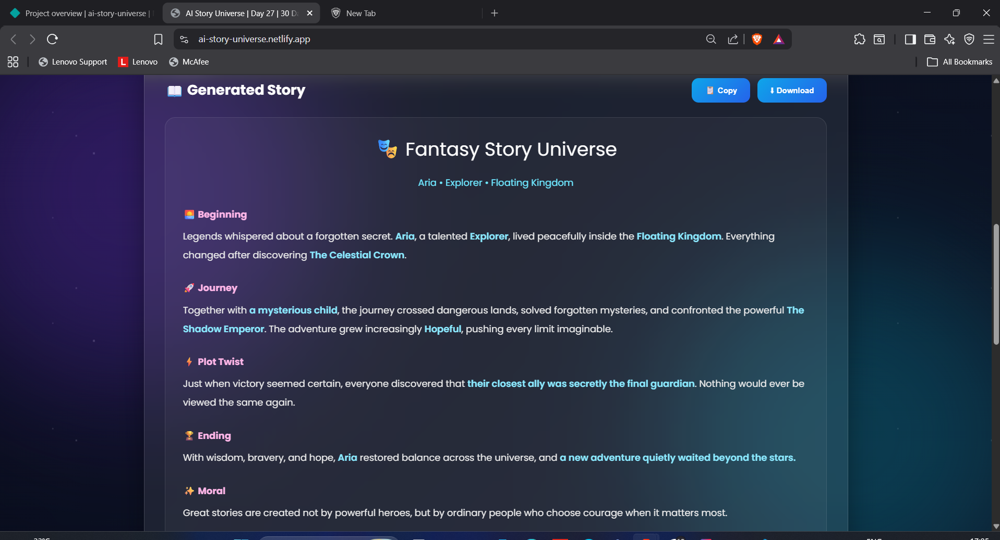

# 🚀 Day 27 of my 30 Days 30 AI Websites Challenge

# 🎭 AI Story Universe

AI Story Universe is an AI-inspired storytelling web application designed to generate unique fictional adventures across limitless worlds.

Instead of displaying pre-written stories, the platform allows users to create dynamic narratives by selecting a genre, main character, role, world, mood, and story length. Every generated story combines intelligent storytelling elements such as memorable heroes, immersive worlds, unexpected plot twists, emotional journeys, and inspiring endings.

The application demonstrates how AI can assist creative writing by generating personalized stories, exploring multiple storytelling styles, and creating engaging narrative experiences through an interactive and responsive interface.

---

## 🌐 Live Demo

https://ai-story-universe.netlify.app/

---

## 📸 Screenshots

---

## ✨ Features

* AI Story Generator
* Multiple Story Genres
* Dynamic Character Creation
* Interactive World Builder
* AI-Inspired Plot Twists
* Emotional Storytelling
* Multiple Story Lengths
* Story Statistics Dashboard
* Copy & Download Story
* Fully Responsive Design

---

## 📋 How It Works

1. Open AI Story Universe.
2. Choose a story genre.
3. Enter the main character's name.
4. Select a role, world, mood, and story length.
5. Click **Generate Story**.
6. Read your AI-inspired adventure.
7. Copy or download your generated story.

---

## 🛠️ Technologies Used

* HTML
* CSS
* JavaScript
* Built with the help of AI-assisted development tools

---

## 🎯 Challenge Progress

✅ Day 27 Completed — AI Story Universe

Part of my **30 Days 30 AI Websites Challenge**, where I build and publish one AI-powered web project every day to improve my frontend development, product-building, UI/UX design, and problem-solving skills.

---

## 👨‍💻 Author

**Bettam Anand**

**BTech CSE(Data Science)**
B.Tech CSE (Data Science)

JNTUH University College of Engineering Palair
